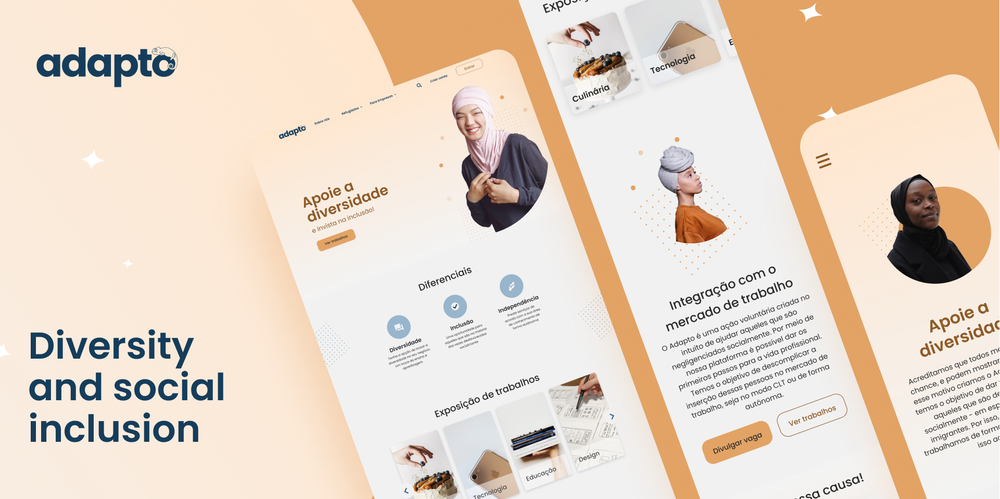

<h1 align="center">
    
</h1>

<h4 align="center">
  Adapto
</h4>

<p align="center">
  
</p>

<p align="center">
  <a href="#layout">Layout</a>&nbsp;&nbsp;&nbsp;|&nbsp;&nbsp;&nbsp;
  <a href="#projeto">Projeto</a>&nbsp;&nbsp;&nbsp;|&nbsp;&nbsp;&nbsp;
  <a href="#tecnologias">Tecnologias</a>&nbsp;&nbsp;&nbsp;|&nbsp;&nbsp;&nbsp;
  <a href="#iniciando-o-ambiente-de-desenvolvimento">Iniciando o ambiente de desenvolvimento</a>&nbsp;&nbsp;&nbsp;|&nbsp;&nbsp;&nbsp;
  <a href="#licença">Licença</a>
</p>

<p align="center">
  
</p>

<br />

## Layout

O style guide e a aplicação foram planejados/prototipados no [Figma](https://www.figma.com/) e podem ser acessados clicando [aqui](https://www.figma.com/file/quchlCq5P1CZdquavXEhxZ/Time-Adapto?node-id=0%3A1).

## Projeto

Adapto e Incluso é uma iniciativa que visa inserir refugiados no mercado de trabalho. Isso seria através do contato entre refugiados e as empresas, dessa forma, permite o primeiro grupo divulgue seu portfólio, trabalhos e experiências; e o segundo grupo divulgue a empresa e as vagas que estão em aberto, visando conectar diretamente com os refugiados cadastrados na plataforma.

O site está no ar e pode ser acessado clicando [aqui](https://adapto-web.netlify.app/).

Nota: O deploy foi feito de forma gratuita no Netlify. Por isso, pode ser que sejam encontrados alguns problemas ao longo do uso da aplicação, principalmente com relação aos processos de autenticação do usuário. Dessa forma, aconselho que, para a melhor experiência no site, o projeto seja executado localmente, através do guia da sessão de setup do [ambiente de desenvolvimento](#iniciando-o-ambiente-de-desenvolvimento).

## Tecnologias

- [Create React App](https://pt-br.reactjs.org/docs/create-a-new-react-app.html) com [Typescript](https://www.typescriptlang.org/)
- [styled-components](https://styled-components.com/)
- [React Hook Form](https://react-hook-form.com/) e [Yup](https://www.npmjs.com/package/yup)
- [React Helmet](https://www.npmjs.com/package/react-helmet-async)
- [React Toastify](https://fkhadra.github.io/react-toastify/introduction)
- [ESLint](https://eslint.org/) e [Prettier](https://prettier.io/)
- [Context API](https://pt-br.reactjs.org/docs/context.html)

## Iniciando o ambiente de desenvolvimento

```bash
git clone https://github.com/Ioasys-Camp-2021/adapto-web.git
cd adapto-web

yarn
yarn start
# ou
npm install
npm run start
```

## Licença

Esse projeto está sob a licença MIT. Veja o arquivo [LICENSE](LICENSE) para mais detalhes.
